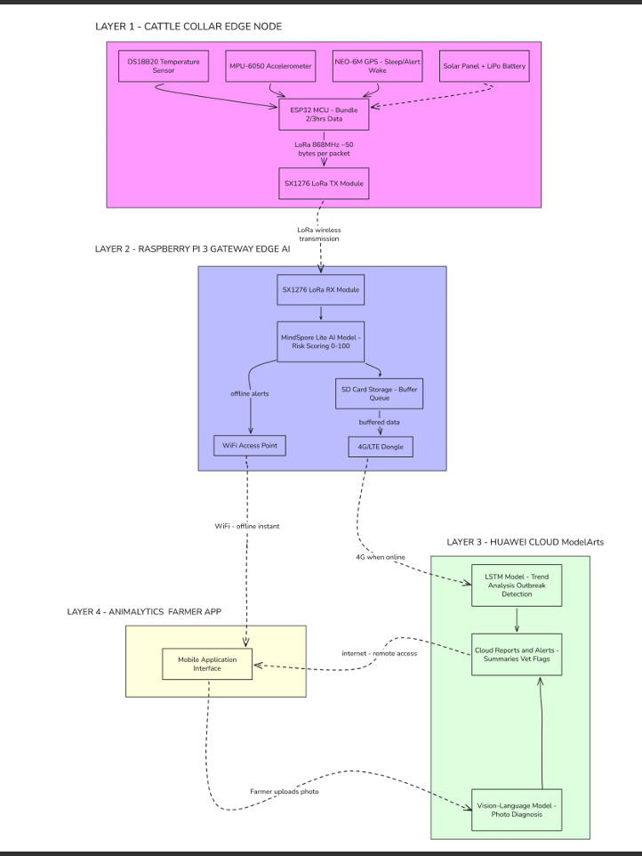

# Animalytics

Animalytics is a farm monitoring dashboard built to support day-to-day cattle health management and field operations.

## What This Project Is For

- Give farmers and farm teams one clear place to track herd condition.
- Highlight urgent and early health alerts so action can be taken quickly.
- Show where animals and workers are located to improve coordination.
- Provide practical summaries that help with treatment prioritization and planning.
- Support faster decisions with a simple, visual, easy-to-use interface.

## Architecture Diagram

